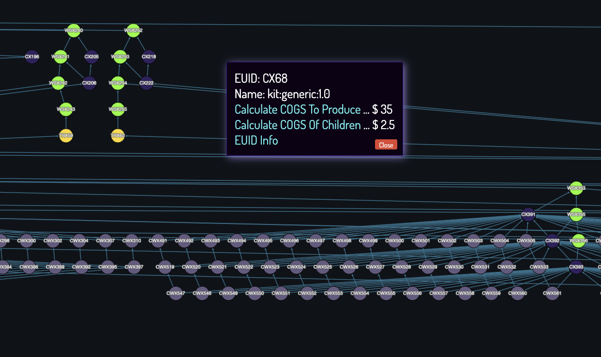
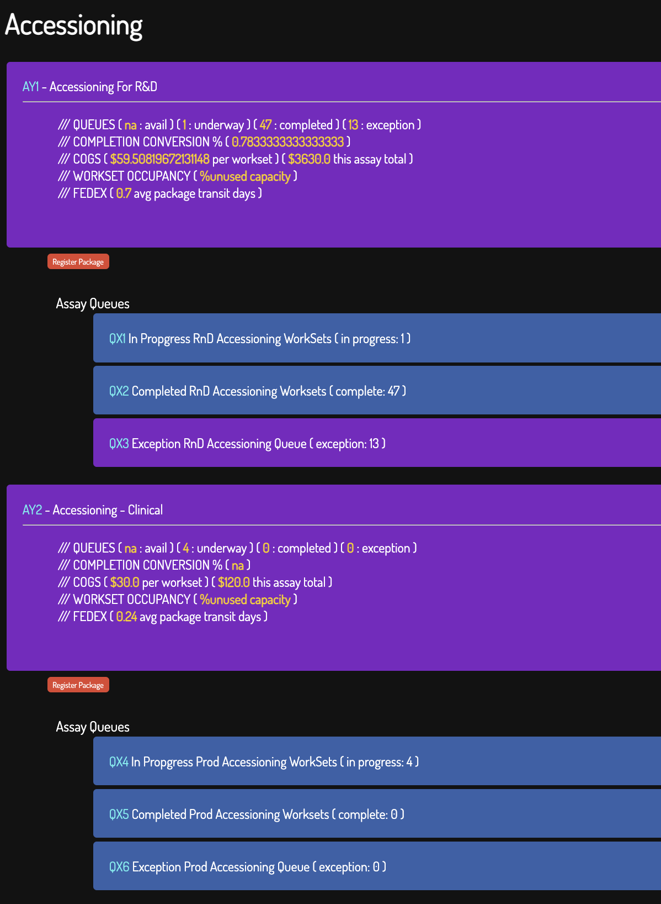
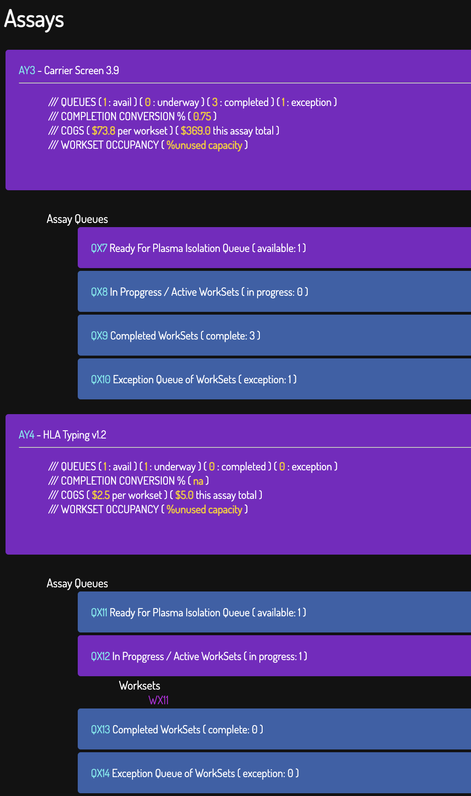
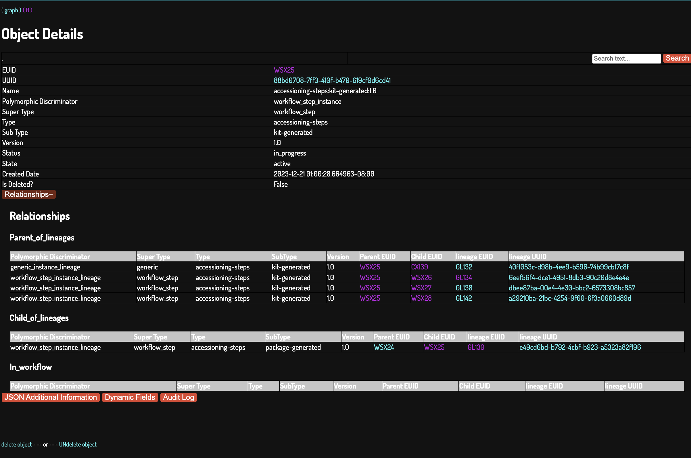
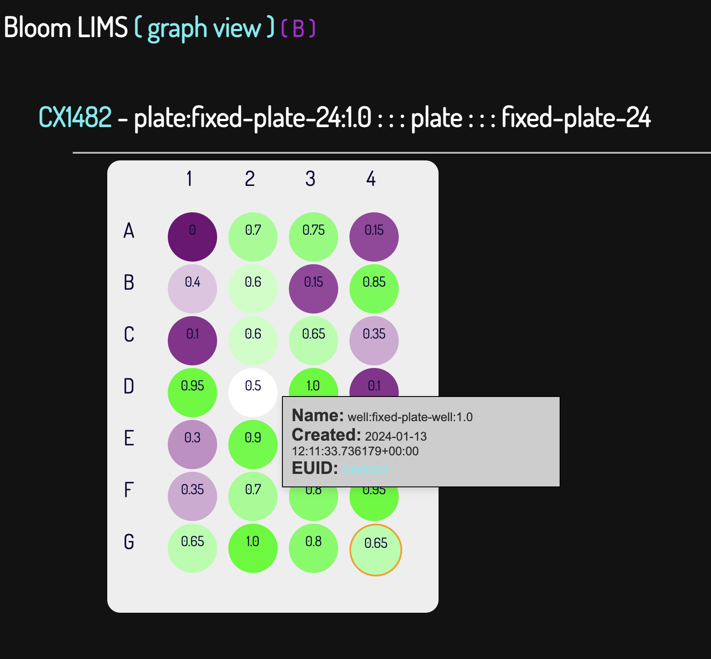
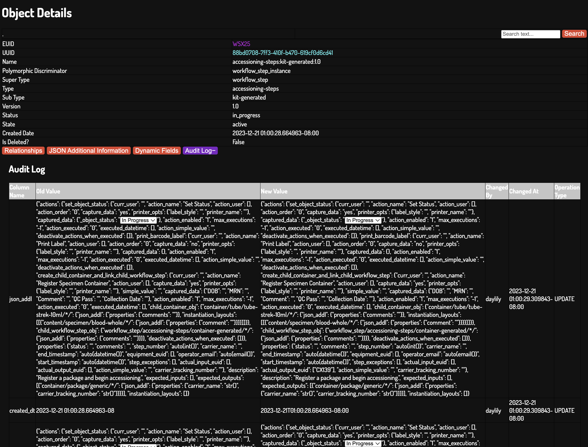
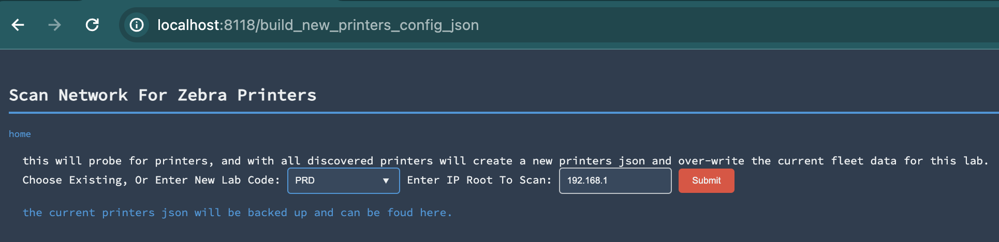

# Bloom : Templated Abstract Polymorphic (and opinionated) LIMS 

_a conceptual gambit in collaboration with chatGPT4_  /// _POC v0.8.17_

[](https://github.com/Daylily-Informatics/bloom/actions/workflows/macos.yaml) [](https://github.com/Daylily-Informatics/bloom/actions/workflows/ubuntu.yaml) [](https://github.com/Daylily-Informatics/bloom/actions/workflows/centos.yaml) 

Built from first principles and drawing upon 30 years experience scaling laboratory process. Constructed with as few object model shortcuts as I could manage ( I believe these shortcuts are among the main reasons LIMS nearly universally dissapoint ). Supporting both arbitrary and prescribed interacting objects. Intended for use: by small to factory scale laboratories, in regulated environments, for both research & operations usecases.  Bloom can handle multiple areas LIS tend to touch: acessioning, lab processes, specimen/sample management, equipment, regulatory and compliance.  Bloom is still in a _functional proof of concept_, so buyer beware. Thoughts, collaborators & [consulting](https://www.linkedin.com/in/john--major/) projects are all welcome! 


# Feature List
* [x] You can have Bloom in operational use in just a few days, including having an integrated universal barcode printing solution as well as integrations with fedex shipmnet tracking. 
* [x] It can be yours for free, forever.
* [x] Hackable!
* [x] Bloom can simultaneously support work in diverse lab facilities, running in parallel, with zero to significant operational overlap.
* [x] Exquisite COGs Visibility. Integrate cost as a real time metric with utility beyond accounting, but also as an in real time process decision making tool.
* [x] Compliant w/CLIA, CAP, HIPAA, GDPR, etc ( as compliant as you wish make the deployment environment )
* [x] You fully control your data.
* [x] Lowers business continuity risk profile.
* [x] Air-gapable (no internet connection required, some _a small number of js libs would need to be served locally_)
* [x] Runs on a diversity of hardware: laptop, desktop box, terrestial cluster, cloud instances.
* [x] Suported OSes: MacOS, Ubuntu & Centos.
* [x] Tech stack comprised of well adopted technologies so dev/maintainence work can be done by a wide range of folks.
* [x] Backup and recovery covered by well adopted postgres management practices.
* [x] Conceptually Rigorous Implementation (models strive to be as atomic as possible)
* [x] Feature Complete Accessioning Process Modeled (atomic detail level)
* [x] Feature Complete Plasma Isolation -> DNA Extraction -> DNA Quant Process Modeled (atomic detail level)
* [x] Comprehensive Audit Trails
* [x] Strict Partitions Between Abstract Objects, Templated Objects & Object Interactions (slightly less so, but plan to improve)
* [x] Complete CRUD UI For All Objects
* [x] Graph CRUD UI For All Objects
* [x] UI Skinnable (ie: dark, light, color blind friendly, add your own!)
* [x] Out of the box objects which cover the large majority of Mol Bio lab use cases.
* [x] Labware / Container Model Supports Any Configuration Labware Modelable via a multidimensional matrix.
* [x] Flexible and Extensible Object Definitions (ie: add your own w/some coding, soon via UI?)
* [x] Quick Start Instance (conda now, docker soon)
* [x] Github Actions Running (for Mac and Linux: tests covering happy path presently).
* [x] FEDEX Tracking Integration (works out of the box)
* [x] Barcode Label Printing Integration (works out of the box)
* [x] A font selected to minimize common reading and transcription errors (some of the worst character offenders: 1, l, I, 0, O, g, j, p, q ... etc).

# Roadmap
* Push loading and running the database to failure on well provisioned EC2 instances. Create detailed preformance profile reports to answer questions re: this aspect of Bloom (which, is top of the list).
* Evaluate the action model, and re-implement with lessons learned.  The ideal end point being a system where users can define some degree of actions w/out requiring mucs/or any core code changes...
* Add json schema validation to the template files.
  * Build UI to allow creating new versions of existing templates... eventually new tempates completely.
* re-work graph view for better performance and more features.
* Stress test loading the database with data to failure, assess and improve.
* Integrate with dashboarding and reporting tools ( ie: [SUPERSET](https://superset.apache.org/) ) 
* Improve test coverage
* Lean into postgres JSONB features more.
* Abstract out the postgres specific bits to allow for any sqlalchemy supported database. (maybe, pg has some valuable features, esp at scale)
  * Given the abstract state of the core db.... create a version which could run on salesforce...? Seems plausible data model wise, the lift would be getting sqlalchemy or similar to work with salesforce.  Daunting and dull.
* Add support for ingesting external system UUIDS?
* Integrate with other UID authorities (ie: google sheets, salesforce, ERM, etc) : for specific cases of linking to things like Patient, Physician, etc. (this can be handled in Bloom, but prob lives more nicely where these objects more naturally live).
* Layer in COGS tracking to allow cost accounting, predictive analytics, and even in-flight process decision making.
* Migration tools for importing existing data from other LIMS && tools to dump to other systems.
* Expanded reporting tools (if even needed... better to focus on external tools for this ?).
* Move to more robust UI stack (away from cherrypy)
* Expose formal REST API ( technically, sqlalchemy can expose this, just no attention has been given to it yet )
* chatGPT4 believes Bloom could be ported to Windows w/out too much trouble.  the core code is pretty OS agnostic, the work would be in the helper scripts which assume dir structures and whatnot.  This is not a priority for me.
* 


# Spoilers
_bloom early peeks_

## Abstract Polymorphism
The ability to refer to objects of different types through a single interface or superclass. This concept is grounded in the principle of polymorphism, which is a key feature of object-oriented programming.

In simple terms, here's how abstract polymorphism works:

Abstract Class or Interface: An abstract class or interface is defined to represent a general concept. This class does not have instances of its own but defines a common structure and behavior that all derived classes must adhere to.

Derived Classes: Different classes (derived classes) are created, each with its own specific implementation. These classes inherit from the abstract class or implement the interface.

Treating Different Objects Similarly: Through polymorphism, objects of these derived classes can be treated as objects of the abstract class or interface. This allows for writing more generic and reusable code, as the exact type of the object doesn't need to be known.

In the context of schema design, this concept allows for the creation of a more flexible and dynamic database structure. For example, you might have an abstract entity "PaymentMethod" with derived entities like "CreditCardPayment" and "PayPalPayment". In the database schema, you can design relationships and queries that operate on the "PaymentMethod" level, allowing for operations that apply to all types of payments without needing to write type-specific code for each payment method.

This approach facilitates easier modifications and extensions to the schema. If a new payment method is introduced, you only need to add a new derived class without altering the existing code that operates on the "PaymentMethod" level. This makes the system more maintainable and scalable.

## Graph Object View (add, remove, edit, take actions, explore)


### Interactive, Dynamic Metrics



## Accessioning Modalities


## Nested Assay / Queue / Workset


## Object Detail


### Specialized Object Detail Views 

#### Labware (ie: a 96w plate) 
_bloom natively will support arbitrarily defined labware, a 96w plate is just one example. Anything that nested arrays of arrays can describe can be configured as a type of labware with next to no effort!_



### Exhaustive & Comprehensive Audit Trails (+soft deletes only)


## Bells And Whistles

* [Integrated with FedEx tracking for entered fedex barcodes](https://github.com/Daylily-Informatics/fedex_tracking_day).

### Integrated Barcode Label Printing For All Objects
* [See detailed docs here](bloom_lims/docs/printer_config.md).
 
  > 

  * [Leverages the zebra_day library](https://github.com/Daylily-Informatics/zebra_day).

## Workflows Available
_examples_

### Accessioning
> Pacage receipt -> kits registration (multiple) -> specimen registration (multiple) -> requisition capture & association  -> adding specimens to assay queues.
> Fedex tracking details fetched, barcode printing available.

### Plasma Isolation -> DNA Extraction -> DNA Quant
> managing all object relationships, tracking all details, printing labels, etc.

# Nuts & Bolts

## Design
I have a lot to say re: design considerations, use cases and so on. This is a quick first pass.

### Process
#### chatGPT4 (and mvcode copilot)
Bloom exists b/c I set out to build something complex in collaboration w/chatGPT4. Specifically, working with it to consider possible solutions to problems rather than telling it how to solve a problem from the start. This was a wild success. I was several times more productive and came to many solutions I would not have otherwise. I also spent a fair amount of time frustrated and churning, though this minor annoyance was totally worth the upside. ps- I never expected a working system to come out of this.

### Schema
abstract polymorphism! there are effectively just 2 tables (object and object_lineage) and 2 accesory tables (audit_log and object_template)

#### ORM
Indeed, `sqlalchemy` is aptly named. 

### TLDR, Graphs
So many nodes and edges.


# Installation

## Prerequisites

* Mac (14+) or Linux OS (ubuntu 22+) - _both tested and run_. Other flavors on linux likely fine. Windows, all bets are off.

* Conda (you may swap in mamba if you prefer). [Installing conda](https://docs.conda.io/en/latest/miniconda.html):

  * be sure `wget` is available to you.
    
  *linux*

  >  x86_64: `wget https://repo.anaconda.com/miniconda/Miniconda3-latest-Linux-x86_64.sh`
  
  >   arm64: `wget https://repo.anaconda.com/miniconda/Miniconda3-latest-Linux-aarch64.sh`

  *macOS*

  > intel: `wget https://repo.anaconda.com/miniconda/Miniconda3-latest-MacOSX-x86_64.sh`

  >   ARM: `wget https://repo.anaconda.com/miniconda/Miniconda3-latest-MacOSX-arm64.sh`

  * Then execute the Miniconda.sh script, follow the prompts, when installation completed, follow these last 2 steps:
 
```bash

~/miniconda3/bin/conda init
bash  # newly created shells should not auto load the conda (base) env.

```


### Very Quickest Start

```bash

# Clone the repository
git clone git@github.com:Daylily-Informatics/bloom_lims.git
cd bloom_lims

# This will attempt to build the conda env, install postgres, the database, build the schema and start postgres
source bloom_lims/env/install_postgres.sh 
 
# conda activate BLOOM if is has not happened already.

# Start the Bloom LIMS UI
 python bloomuiiu.py .  # This will block the terminal. You can visit the UI at http://localhost:58080

```

#### optional, install and run pgadmin4 database admin UI

```bash

# RUN TESTS
pytest

# START THE UIs (on localhost:8080)
source bloom_lims/env/install_pgadmin.sh 

```

#  Usage
_mostly stubbed out_

## API
* for now: see bloom_limm/bdb.py for the ORM code.

## UI

### Bloom UIs
* no docs yet

#### Graph (fully interactive) 
* no docs yet

##### All ORM CRUD Actions, Exploration & Complex Actions


#### Nested View 
* no docs yet

##### Work Queues ( to begin, continue, and monitor work )
* lists of work to be done.

##### Workflow Progression ( All ORM CRUD Actions & Complex Actions)
* progressing through a workflow & recording all pertinent details along the way.

##### Object Detail View ( navigate all relationships && comprehensive audit trail of every change to the object )
Only `delete` and `undelete` are not available from this view.
* no docs yet

##### Object Instantiation View
For creating instances of each object type. More for admin / unexpected use cases.

##### Bulk Operations
Many supported in workflows, but there will be a place for needs outside workflows.

##### Pan-Bloom Search
* EUID searching is enabled in both UIs, but free text search across the entire system is not exposed yet.

## Reports (both longitudinal/process monitoring as well as larger ad hoc rollups)
* The data is there, this is easy, but will depend on your requirements.

## Bulk Import To Create New Records
* no docs yet

## Integrations

### CRMs
If they have APIs, integration to fetch things like physician or patient identifiers/metadata is straight forward.

#### ie: Salesforce
* coming soon!

### Google Sheets
* no docs yet

### Zebra Barcode Label Printing
* In place, no docs yet. Uses [zebra_day](http://github.com/Daylily-Informatics/zebra_day).

## FedEx Tracking API Integration
* In place, no docs yet. Uses [fedex_tracking_day](http://github.com/Daylily-Informatics/fedex_tracking_day).

## Migration From Other LIS 
* seems plausible.

## Migration To Other LIS
* dump the postgres database, and you have it all.

# Design, Continued

## Design Principles

### Enterprise UIDs
* [stripe uuid](https://stripe.com/docs/api/identity/object#identity_object-verification-document)

#### Each Object Has A UUID & UUIDs Are Immutable & UUIDs Are Not Reused Or Applied To Other Objects
* Using a UUID on children objects for convenience will lead to a mess as the need to know details about each object is next to impossible when a UUID is assigned to multiple objects.

#### The UID Identifies The Object Class And The UUID w/in The Class
* that is all [reference regarding not putting metadata in a uuid](https://stackoverflow.com/questions/19989481/what-is-the-best-way-to-store-metadata-for-a-file-in-postgresql)

#### Exhaustive Metadata About An Object May Be Queried Using The Enterprise UUID.
##### Metadata may also be printed on labels along with the UUID.
* Keeping metadata out of the UUID formula is a fundamental requirement in building flexible and scalable systems. FUNDAMENTAL.

#### Trust The Database To Manage The UUIDs
* ...


### Clear And Concise Data Model
* ...

### TSV's not CSV's
* there are few/no compelling reasons to use CSV's over TSV's & so many reasons not to use CSV's.


#### All LIMS Data Editable w/CRUD UI
* It is! Fully (though with some safeguards still not in place).

#### Easily configurable object definitions as well as actions (ie workflows, etc)
* Requiring as little code changes as possible. 

### Other
* Simple
* Scalable
* Secure
* Flexible & Extensible
* Open Source
* Operationally Robust
* Free
* Sustainable
  * [as defined in the snakemake rolling paper](https://f1000research.com/articles/10-33/v1)


## Requirements
* still largely in my head or hard notes.

## Use Cases 

### LIMS Actions (must have)

#### Many To Many Relationships Among All Objects
All other relationships are subsets of this, and designing parts of the LIMS which disallow many to many will result in an inflexible system.

#### Objects May Be Involved In Multiple Workflows Simultaneously

#### Support For Predefined and Arbitrary Workflows

#### Objects may all be: root (singleton, parent & able to become a child at some point), child(singleton, parent and possibly terminal) of one another

#### Zero Loss Of Data (comprehensive audit trails, soft deletes) && 100% Audit Coverage


## Deployment & Maintanence
You may deploy bloom wherever it will run. This does mean you are responsible for all aspects of the deployment, including security, backups (AND recovery), performance optimization, monitoring, etc. This need not be daunting. [I am available for consulting on there topics](https://www.linkedin.com/in/john--major/).


## Testing
* with pytest

```bash

conda activate BLOOM
pytest

```

## Regulatory & Compliance
### CLIA
* There is no reason bloom can not be used in a CLIA regulated environment.

### CAP
* Bloom can satisfy all relevant CAP checklist items which apply to it. But, as it is s/w you will be running yourself, most checklist items will be concerned with the environment you are using bloom in.

### HIPAA  
* If installed in an already HIPAA compliant environment, bloom should not need much or any work to be compliant.


# Other


# Support
* no promises, please file issues to log a bug or request a feature.


# Authors
* [John Major:li](https://www.linkedin.com/in/john--major/) aka [iamh2o:gh](http://github.com/iamh2o)

# License
* MIT

# References // Acknowledgments
* [chatGPT4](http://chat.openai.com/) for helping me build this.
* All the folks I've built systems for to date and were patient with my tools and offered helpful feedback.
* [snakemake](https://f1000research.com/articles/10-33/v1) :: inspiration.
* [multiqc](https://multiqc.info/) :: inspiration.
* [ga4cgh](https://ga4gh.org/) :: inspiration.
* [the human genome project](https://www.genome.gov/human-genome-project) :: where I learned I dug LIS.
* [cytoscape](https://cytoscape.org/) :: incredible graph visualization tools!
* The OSS world.
* [Semantic Mediawiki](https://www.semantic-mediawiki.org/wiki/Semantic_MediaWiki) :: inspiration.
* [Datomic](https://www.datomic.com/) :: inspiration.


# Interesting Tidbits To Follow Up On
* [Dependency Hell // DBT](https://medium.com/tiqets-tech/taming-the-dependency-hell-with-dbt-2491771a11be)
* [TypeDB](https://www.linkedin.com/pulse/dawn-polymorphic-database-vaticle-3jacc/) has a good treatment of what Bloom is attempting to do, data modeling wise.
  > There are three forms of polymorphism in computer science
  In order to be fully polymorphic, a database must implement the three fundamental kinds of polymorphism possible in object-oriented programming:
  * Inheritance Polymorphism: The ability to define a class hierarchy where children inherit properties from their parents, and to interpret queries that operate on instances of a class and all its children.
  * Interface Polymorphism: The ability to define properties as interfaces that classes can implement independently of their parents, and to interpret queries that operate on instances of all classes that implement a specified interface.
  * Parametric Polymorphism: The ability to interpret queries that are abstract and able to operate on instances of any class supplied as a parameter to the query.

  > To be fully polymorphic, a database has to implement three systems
  When combined with a declarative query language, these kinds of polymorphism allow for a natural way of structuring and querying information that is consistent with object-oriented principles and conceptual data modeling. In order for a database to be able to correctly interpret the intent behind a declarative polymorphic query, three things are required:
    > Variablizable Language: A query language that is expressive enough to variablize classes, either explicitly or implicitly. This is required to describe interface and parametric polymorphism, and so declaratively capture the intent of the query.
    Polymorphic Schema: A schema or equivalent metadata store containing the semantic context for interpreting the query’s intent. It must contain the class and interface definitions, the class hierarchy, and the interface implementations.
    Inference Engine: An inference engine for reducing the declarative query into an imperative form before being sent to the query planner. This is based on the structure of the query combined with the semantic context provided by the schema.


# LIMS Anti-Patterns ( ideas )
* Encoding anything other than a uniquely identifying string in a barcoded identifier. Must have: EUID, nice to have (or in addition): true UUIDs.
* Are identifers able to uniquely identify the one thing it should be representing?  If an input tube is transfered to a second tube, and then the second to a third, if each is re-assigned the ID of the first, this is a very serious architecture problem (and very common), you now have no way to work with the three tubes and know clearly which is which.
  * Corrolary, if this pattern is in place to acheive batching capabilities... this is a valid usecase, but this implemnentation approach results in both inadequate batch tracking as well as inadequate thing tracking.
* Optimizing for human convenience over a robust system which often requires some costs to human convenience. ie: dragging and dropping lists of UIDs to progress a workflow is a very poor way to accomplish this transition compared to requiring (human or automated) scanning of the actual things.  The latter is more tedious, but fantastically less error prone than a human on a UI (and probably lacking all manner of checks like:  were all tubes dragged and dropped actually in the set moved along?)
* Adding complexity for peace of mind.
* A fully manual process is, practically by definition, not well suited for integration with a LIMS. Adopting a LIMS and attempting to directly map an existing process into the LIMS is much more likely to result in a dissapointing LIMS implementation than if adopting a LIMS is approached as an opportunity to re-think the OPERATIONS of the process and how a LIMS can manage the process, but most importantly, how a LIMS can allow operations not possible in a manual flow.
  * This said, the best case scenario is that development work can be carried out in a minimal version of the LIMS which the process will be scaled up w/in.
* How does the LIMS integrate with automation robotics?  Or even barcode printers?  These are some of the main reasons LIMS are adopted, to allow scale.  Can the LIMS being used work with the components which are required to scale (robotics)?
* Can you hack it?
* What does disaster recovery look like?  Have you tested recovering from backups?  Has this been delegated to a vendor (and is the matter now considered someone elses problem ... someone outside the org?).
* Do pricing models restrict how many users can access the LIMS? The insights gained by access to the metadata LIMS accumulates are substantial. Limiting access to LIMS will have a detrimental effect on generating these operationally important insights.  This is hard to measure, and often not considered, but is a very significant cost IMO.
* Can colorblind folks easily use the LIMS?
* Were reports desired to be generated from the LIMS part of the initial requirements? If not, is it suprising if the LIMS misses the mark in this regard?
* Is perfection considered the goal?  It's a terrible goal: unachivable and quite a cost to resources.  
  * codepilot suggested this additional sentence:
      > If so, what is the cost of this perfection?  Is it worth it?  Is it even possible?  Is it possible to know if it is possible?  Is it possible to know if it is worth it?  Is it possible to know if it is possible to know if it is possible to know if it is worth it?  Is it possible to know if it is possible to know if it is possible to know if it is possible to know if it is worth it?  Is it possible to know if it is possible to know if it is possible to know if it is possible to know if it is possible to know if it is worth it?
* Are the bioinformaticians/engineers who are working with the lab partners in building the LIMS, or are they building to specifications? Any successful LIMS implementation must be more the former than the latter.  The lab users do not necessarily know what is possible from an engineering perspective. The engineers do not necessarily understand the vagaries of a physical lab process. If either group are 'in charge', things will go off the rails. I'll harp on unique identifiers as an example.  Lab folks with a manual process experience, will frequently ask for metadata to be added to the UID.  If blindly implemented, all the problems to be expected from this design pattern follow. Many engineers have not worked in a domain where the code they write interacts so heavily with the real world. The engineers may force the use of true UUIDs for objects (and the problem here, is that in the lab, often these identifiers must be affixed to physical objects, and a UUID will usually be far too long).
* Requirements should not be created assuming what is/is not possible.  This is one of the most insidious drivers of LIMS failures.
* Is the tech stack approachable?
* Is the tech stack sustainable?  

 
