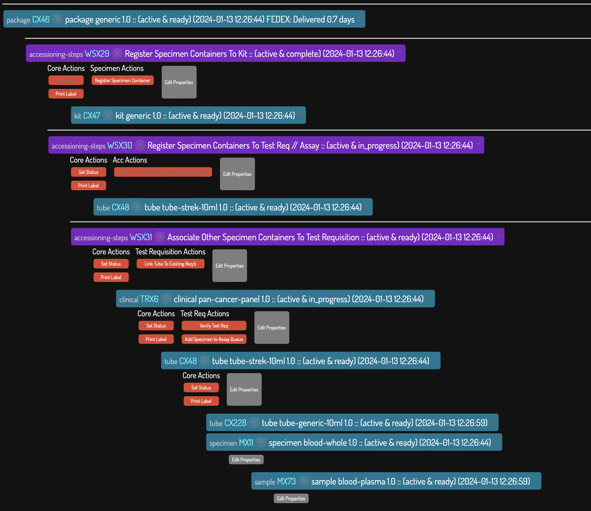

# Bloom : Templated Abstract Polymorphic (and opinionated) LIMS 
_a conceptual gambit in collaboration with chatGPT4_  /// _POC v0.9.6_


[](https://github.com/Daylily-Informatics/bloom/actions/workflows/macos.yaml) [](https://github.com/Daylily-Informatics/bloom/actions/workflows/ubuntu.yaml) [](https://github.com/Daylily-Informatics/bloom/actions/workflows/centos.yaml) 

Built from first principles and drawing upon 30 years experience scaling laboratory process. Constructed with as few object model shortcuts as I could manage ( I believe these shortcuts are among the main reasons LIMS nearly universally dissapoint ). Supporting both arbitrary and prescribed interacting objects. Intended for use: by small to factory scale laboratories, in regulated environments, for both research & operations usecases.  Bloom can handle multiple areas LIS tend to touch: acessioning, lab processes, specimen/sample management, equipment, regulatory and compliance.  


# Spoilers
_bloom early peeks_

## Oauth2 Authentication w/All Major Social Providers
_and flexible whitelisting, etc..._
* [Bloom supabase config](documents/supabase.md).

## Graph Object View (add, remove, edit, take actions, explore)

### Interactive, Dynamic Metrics


## Accessioning Modalities


## Nested Assay / Queue / Workset


## Intantiate Objects From Available Templates


## Object Detail


### Specialized Object Detail Views 

#### Labware (ie: a 96w plate) 
_bloom natively will support arbitrarily defined labware, a 96w plate is just one example. Anything that nested arrays of arrays can describe can be configured as a type of labware with next to no effort!_


### Exhaustive & Comprehensive Audit Trails (+soft deletes only)


## Bells And Whistles

* [Integrated with FedEx tracking for entered fedex barcodes](https://github.com/Daylily-Informatics/fedex_tracking_day).

### Integrated Barcode Label Printing For All Objects
* [See detailed docs here](bloom_lims/docs/printer_config.md).
 
  > 

  * [Leverages the zebra_day library](https://github.com/Daylily-Informatics/zebra_day).

## Workflows Available
### Accessioning
> Pacage receipt -> kits registration (multiple) -> specimen registration (multiple) -> requisition capture & association  -> adding specimens to assay queues.
> Fedex tracking details fetched, barcode printing available.
### Plasma Isolation -> DNA Extraction -> DNA Quant
> managing all object relationships, tracking all details, printing labels, etc.


# Installation

## Prerequisites

### Hardware Supported
_see build test badges above for all supported platforms_
* Mac (14+) 
* Ubuntu 22+
* Centos 9

### Conda
* Conda (you may swap in mamba if you prefer). [Installing conda](https://docs.conda.io/en/latest/miniconda.html):

  * be sure `wget` is available to you.
    
  *linux*

  >  x86_64: `wget https://repo.anaconda.com/miniconda/Miniconda3-latest-Linux-x86_64.sh`
  
  >   arm64: `wget https://repo.anaconda.com/miniconda/Miniconda3-latest-Linux-aarch64.sh`

  *macOS*

  > intel: `wget https://repo.anaconda.com/miniconda/Miniconda3-latest-MacOSX-x86_64.sh`

  >   ARM: `wget https://repo.anaconda.com/miniconda/Miniconda3-latest-MacOSX-arm64.sh`

  * Then execute the Miniconda.sh script, follow the prompts, when installation completed, follow these last 2 steps:
 
```bash
~/miniconda3/bin/conda init
bash  # newly created shells should not auto load the conda (base) env.
```
### Supabase
* [Please follow the supabase configuration instructions here](documents/supabase.md).


## Very Quickest Start
_assumes you have completed the prerequisites_

```bash
# Clone the repository
git clone git@github.com:Daylily-Informatics/bloom_lims.git
cd bloom_lims

# This will attempt to build the conda env, install postgres, the database, build the schema and start postgres
source bloom_lims/env/install_postgres.sh 
 
# conda activate BLOOM if is has not happened already.

# Start the Bloom LIMS UI
source run_bloomui.sh

```

### (optional) Install & Run pgadmin4 Database Admin UI

```bash

# RUN TESTS
pytest

# START THE UIs (on localhost:8080)
source bloom_lims/env/install_pgadmin.sh 

```


## Integrations

### CRMs
If they have APIs, integration to fetch things like physician or patient identifiers/metadata is straight forward.

### Zebra Barcode Label Printing
* In place, and works [See detailed docs here](bloom_lims/docs/printer_config.md).
* Uses [zebra_day](http://github.com/Daylily-Informatics/zebra_day).

## FedEx Tracking API Integration
* In place, no docs yet, but will work if you create the config `yaml` file for this library: [fedex_tracking_day](http://github.com/Daylily-Informatics/fedex_tracking_day).

#### ie: Salesforce
* with `simple_salesforce` or `salesforce` python packages, would be very straight forward.


## Design Principles

### Enterprise UIDs
* [stripe uuid](https://stripe.com/docs/api/identity/object#identity_object-verification-document)

#### Each Object Has A UUID & UUIDs Are Immutable & UUIDs Are Not Reused Or Applied To Other Objects
* Using a UUID on children objects for convenience will lead to a mess as the need to know details about each object is next to impossible when a UUID is assigned to multiple objects.

#### The UID Identifies The Object Class And The UUID w/in The Class
* that is all [reference regarding not putting metadata in a uuid](https://stackoverflow.com/questions/19989481/what-is-the-best-way-to-store-metadata-for-a-file-in-postgresql)

#### Exhaustive Metadata About An Object May Be Queried Using The Enterprise UUID.
##### Metadata may also be printed on labels along with the UUID.
* Keeping metadata out of the UUID formula is a fundamental requirement in building flexible and scalable systems. FUNDAMENTAL.

#### Trust The Database To Manage The UUIDs
* ...


### Clear And Concise Data Model
* ...

### TSV's not CSV's
* there are few/no compelling reasons to use CSV's over TSV's & so many reasons not to use CSV's.


#### All LIMS Data Editable w/CRUD UI
* It is! Fully (though with some safeguards still not in place).
  * _soft deletes need to be reviewed more closely_

#### Easily configurable object definitions as well as actions (ie workflows, etc)
* Requiring as little code changes as possible. 

### Other
* Simple
* Scalable
* Secure
* Flexible & Extensible
* Open Source
* Operationally Robust
* Free
* Sustainable
  * [as defined in the snakemake rolling paper](https://f1000research.com/articles/10-33/v1)


## Use Cases 

### LIMS Actions (must have)

#### Many To Many Relationships Among All Objects
All other relationships are subsets of this, and designing parts of the LIMS which disallow many to many will result in an inflexible system.

#### Objects May Be Involved In Multiple Workflows Simultaneously

#### Support For Predefined and Arbitrary Workflows

#### Objects may all be: root (singleton, parent & able to become a child at some point), child(singleton, parent and possibly terminal) of one another

#### Zero Loss Of Data (comprehensive audit trails, soft deletes) && 100% Audit Coverage


## Deployment & Maintanence
You may deploy bloom wherever it will run. This does mean you are responsible for all aspects of the deployment, including security, backups (AND recovery), performance optimization, monitoring, etc. This need not be daunting. [I am available for consulting on there topics](https://www.linkedin.com/in/john--major/).


## Testing
* with pytest

```bash

conda activate BLOOM
pytest

```

## Regulatory & Compliance
### CLIA
* There is no reason bloom can not be used in a CLIA regulated environment.

### CAP
* Bloom can satisfy all relevant CAP checklist items which apply to it. But, as it is s/w you will be running yourself, most checklist items will be concerned with the environment you are using bloom in.

### HIPAA  
* If installed in an already HIPAA compliant environment, bloom should not need much or any work to be compliant.


# Support
* no promises, please file issues to log a bug or request a feature.


# Authors
* [John Major:li](https://www.linkedin.com/in/john--major/) aka [iamh2o:gh](http://github.com/iamh2o)
* Josh Durham
* Adam Tracy

# License
* MIT

# References // Acknowledgments
* [chatGPT4](http://chat.openai.com/) for helping me build this.
* All the folks I've built systems for to date and were patient with my tools and offered helpful feedback.
* [snakemake](https://f1000research.com/articles/10-33/v1) :: inspiration.
* [multiqc](https://multiqc.info/) :: inspiration.
* [ga4cgh](https://ga4gh.org/) :: inspiration.
* [the human genome project](https://www.genome.gov/human-genome-project) :: where I learned I dug LIS.
* [cytoscape](https://cytoscape.org/) :: incredible graph visualization tools!
* The OSS world.
* [Semantic Mediawiki](https://www.semantic-mediawiki.org/wiki/Semantic_MediaWiki) :: inspiration.
* [Datomic](https://www.datomic.com/) :: inspiration.


# Dev Tools
__note:__ all commands below are expected to be run from a shell with conda activated.
`conda activate BLOOM`

## Drop The Entire Database(loose all data!) > Rebuild The Database / Re-seed With All Accessible json Templates

**The steps are wrapped in a script, please see [clear_and_rebuild_postgres.sh](bloom_lims/env/clear_and_rebuild_postgres.sh).**

It is executed as follows:
```bash
source clear_and_rebuild_postgres.sh
```

### Stop pgsql
- `source bloom_lims/bin/stop_bloom_db.sh` 

### Remove the db
- `rm -rf bloom_lims/database/*`

### Rebuild the schema
-  `source bloom_lims/env/install_postgres.sh skip` the skip will skip building the conda env. This will start pgsql in the env, and build the schema.

### Build LIMS Workflows With Autogen Objects
Similar to `pytest`, but more extensive. Largely useful in development work.  The following will auto-gen 'n=2' passes of the lims schema
- `python tx.py 2 `.

### Run the bloom UI
- `source source run_bloomui.sh`
 
### Run the pgadmin UI
- `source bloom_lims/env/install_pgadmin.sh`

### Start Interactive Shell w/Core Bloom Objects Instantiated
`python bloom_shell.py` 
 
 
 # Random Notes
 ## File System Case Sensitivity
 ### MacOS is Not Case Sensitive
```tsh
echo "test" >test.log
echo "TEST" >TEST.LOG
more test.log
TEST
more TEST.log
TEST
```
 * This still shocks me & is worth a reminder.

### Ubuntu Is Case Sensitive
```bash
echo "test" > test.log
echo "TEST" > TEST.LOG
more test.log
test
TEST.LOG
TEST
```

### Assume Case Insensitivity In All File Names 
 *  Given we can not be certain where files will be reconstituted, we must assume that files might be created in a cases insensitive file system when allowing download. 

#### Bloom UUIDs and EUIDs Are Safe As File Names
A widely adopted UUID spec (and used by postgres), [rfc4122](https://datatracker.ietf.org/doc/html/rfc4122), treates uc and lc as the same character. Bloom EUIDs only contain uc characters in a prefix followed by integers.
 
 
 
