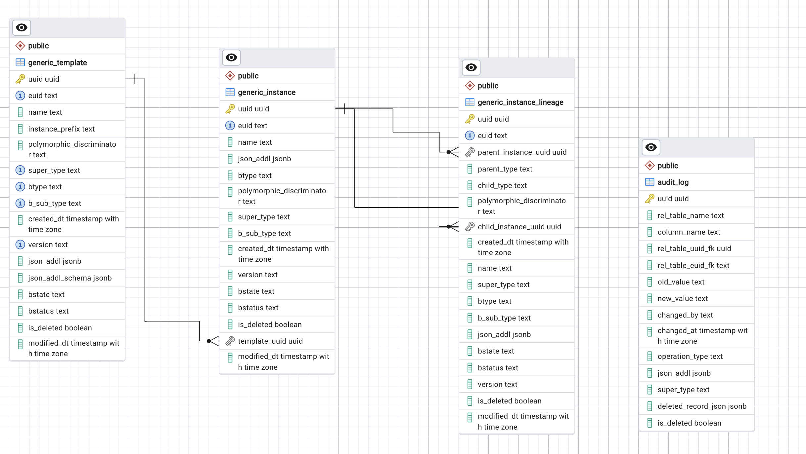
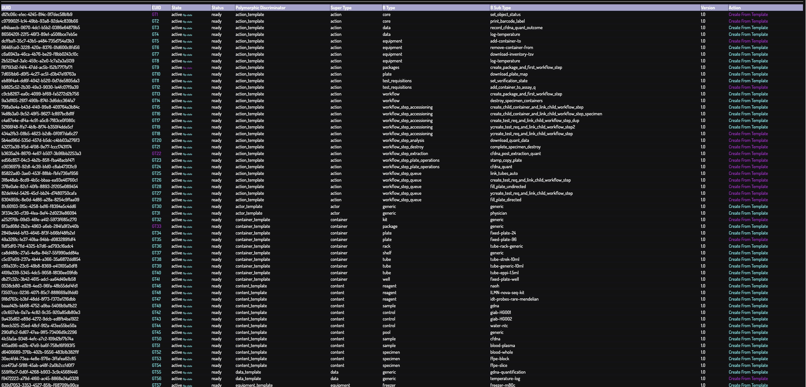
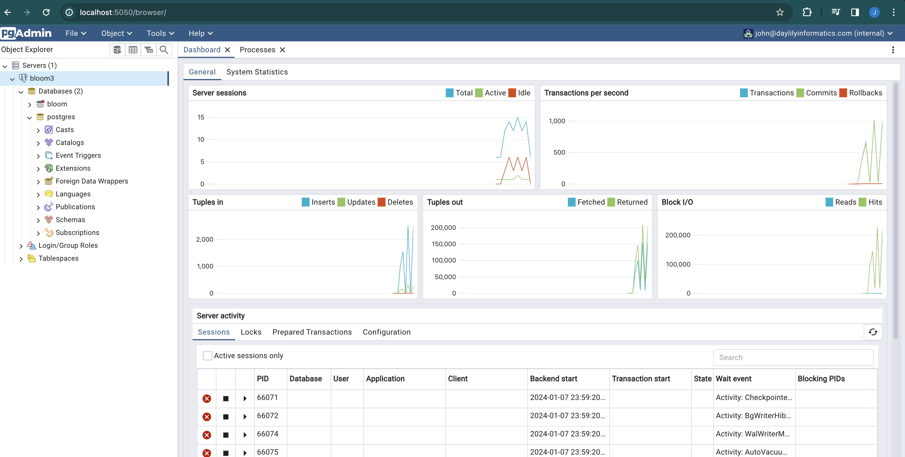

# Overview
These are the design principles I went to great lengths to adhere to while building Bloom. Sometimes the principle was modified, but more often, I refactored to meet the principle.  ChatGPT4 was a very great help in allowing me to do this.


## Design Principles

### Expressive & Extensible Data Model 

* Objects modeled to atomic units. ie: wells in a plate.
* Object conflation avoided. ie: a tube is not the same as the blood in the tube, in fact these are both modeled independently.
* Object relationships are not simplified. In fact, all objects can have many to many relationships with all objects. The database should track these relationships, but not enforce them.
  * Do not define types for each possible combination of relationships. (reword this)... try to maintain a minimal relationship model, specifically for containers and contents.  root, leaf, parent-child and pools should all be possible.  However, every 'content' should only ever be in a container 1x!!! A content should not be copied to a new container if moved... the new container should be created, linked to the parent container and the new content should be created, linked to the new container, and also linked to the parent content.
  * THIS does result in what looks like a ton of double book keepiung.  So far, it has not been a problem, and I think might not be double accounting per-se. It can be useful to track content lineages w/out having to navigate through containers.  This has also simlified the container-content object b/c a container will only ever contain 0-1 contents and a content only exist in 1 container.
  * * One slight exception to this purity, is that a content MAY have new parent lineages added to it in cases that a pool or child has another content added to it.
  * One goal of this fussy scenario was to avoid a model where a well had a different key for all the types of things it could have in it.
  *  
* The database only models the object instance templates, and the object instance lineages among each other. No type specific restrictions are imposed by the schema/db.
* Object template definitions should not live in the databse or in code, but in a human readable format. ie: json. This allows for eventual user creation/editing of templates and interactions.
* * Templates can reference other object types (ie: if a plate object has a certain well layout, and the wells are auto-created with specific contents, this can be specified in the template so that instantiated objects are created thusly.)
* * Templates can also define actions possible for the object.
* Template json are defined as text json files, and loaded when the DB is initialized, after that, the template are not used. The template definitions in PG should not be edited. Changes to a template should trigger a new template version (or subtyp)
* Object relationships can be created arbitrarily, and can be bounded by rules (however, the first requirement will not be violated in order to enforce a rule).


#### Abstract Polymorphic Object Model
Chatgpt has dubbed the approach to satisfyting these principles 'Abstract Polymorphism' (or maybe Abstract Templated Polymorphism?)
* Effectively, postgres is modeling a graphDB of sorts.  I stayed with PG rather than a gdb b/c I wanted to keep using the ORM and I planned to more heavily use the PG json/jsonb fields functionality in managing sub-types of objects.

### Comprehensive Audit Trails
For ALL fields in ALL objects, the following should be tracked:
* creation are tracked, with datetimes and TZ and user creating.
* field updates.
* DELETIONS are handled by soft deletes, and should be uncommon. The orm by default will not return or traverse soft deleted objects/edges.
* * note:  soft deletes are also being used to accomplish things like moving tubes in/out of queues while maintaining a history that the tube was in various queues.

### Versatile Deployment Options
* Bloom should be able to be spun up by a git savvy, but non-swe user so that they may poke around in a NON PROD deployment.  Right now, this is conda.
* Bloom should have a production deployment plan for more robust use.

### Avoid Conceptual Shortcuts
* Largely relevant to the data model, but generally, if building a shortcut for convenience in implementation... it's probably a mistake.

### Admin CRUD UI
* pgadmin

### Commonly Understood Tech Stack
* For bioinformaticians & appropriate for the domain LIMS are built in/for. (so, do not use some stack intended for web microservices, for example)

### Data Visualization UI For Exploration & Interactions
* cytoscape and jinja2 seems to be a good start.

### Strong Partitions Between Datastore, Object Model and UI

### Dont Reinvent The Wheel (aka, don't try to do it all)
* Focus on making the core datamodel and ORM super super solid. Build out admin kinds of UIs/reports/etc... but for things like production implemneted skins, reporting, dashboards, etc.... integrate with well regarded OSS solutions.

### Free & Open Source
* It should be.


## Pictures

### Postgres Schema
Three operational tables only!
* generic_template : holds the template definitions which can be instantiated as instancees.
* generic_instance : instantiated templates have entries here. These are the objects that are tracked in the LIMS. The polymorphic_discriminator and other subtype fields differentiate the object types and subtypes. The polymorphic_discriminator is used by sqlalchemy to dynamically assign the correct class to the object.  NOTE! I for sure have too many and some reduntant typing feilds in here.  I need to clean this up.
* generic_instance_lineage : This table tracks relationships between objects. Thanks to the sqlalchemy polymorpic magic, this is all handled by one table.  I am uncertain if the lineages need to be subtyped, or if they can all be generic....
* And then a table for audit logging.



### ORM
The sqlalchemy ORM allows for dynamic generation of classes as defined by the polymorphic_discriminator field in PG. These classes are effectively the top level directories named in `bloom_lims/config/`. These subclass distinctions resulted from a lot of pondering, certainly not perfect. The typing is only needed to manage action routing right now, and arguably could be removed in place of just generics...?

#### Common Fields To All Three Tables
```python

    uuid = Column(UUID, primary_key=True, nullable=True, server_default=FetchedValue())

    euid = Column(Text, nullable=True, server_default=FetchedValue())
    name = Column(Text, nullable=True)

    created_dt = Column(TIMESTAMP, nullable=True, server_default=FetchedValue())
    modified_dt = Column(TIMESTAMP, nullable=True, server_default=FetchedValue())

    polymorphic_discriminator = Column(Text, nullable=True)

    super_type = Column(Text, nullable=True)
    btype = Column(Text, nullable=True)
    b_sub_type = Column(Text, nullable=True)
    version = Column(Text, nullable=True)

    bstate = Column(Text, nullable=True)
    bstatus = Column(Text, nullable=True)

    json_addl = Column(JSON, nullable=True)

    is_deleted = Column(BOOLEAN, nullable=True, server_default=FetchedValue())
```

* UUID : Used as database keys among objects b/c of performance and it felt better? downside is maintianing UUID and EUIDs... but seems ok.
* EUID : The EUID for the entry. Which will be unique across the entire schema for all instances. The prefix is configurable by editing the metadata.json files in each class def dir.  This also does require a schema update for a new index and a trigger update to handle the new prefix.
* * EUIDs are the orm bread and butter.  use of UUIDs should be removed where they linger (I think)
* Name: right now, is a concatemer of sub-fields.  Can prob be removed, but I am reluctant to?  This is NOT the object name the user can set (that is in the json_addl['properties']['name'] field)
* created_dt : when the object was created, w/TZ
* modified_dt : when the object was last modified, w/TZ (for bookkeeping and to prevent dag UI generation when not necessary)
* polymorphic_discriminator : sqlalchemy magic field to allow for polymorphic inheritance.  This is the field that allows the ORM to know which class to instantiate when querying the DB.  It is `{btype}_[template|instance|instance_lineage]` and controls what class sqlalcehmy instantiates.

* super_type : This names a top level class, which can have various child subtypes, etc.  This corresponds to the directories found in `bloom_lims/config/`.
* btype : This is the name of the first removed child sub-class.  This corresponds to the json file name in the `bloom_lims/config/{super_type}/` dir.
* b_sub_type : This is the name of the second removed child sub-class.  This corresponds to the *KEYS* in the json files in the `bloom_lims/config/{super_type}/{btype}.json` dir.
* version : This is the version of the b_sub_type instance. Meant to capture finer differences in the same b_sub_type. VERSION are all keys below the 'b_sub_type' json file top level keys.  This is not really in use.  I had tinkered with allowing specifying a `*` for all versions, and largely just assume this means 1.0. TLDR: this is not well considered yet.

* bstate : Not really in use. Intended to capture the instance state && I wanted to distinguish between state and status. 
* bstatus : Not really in use. Intended to capture the instance status && I wanted to distinguish between state and status.

* json_addl : This is the json blob that holds all the instance data.  Including data that distinguises the object from others, some is 'protected' from user editing, some are intended to be user edited.  'Actions' are embedded here, as defined in the intance template... and this includes stateful action data.... I'm not sure how I feel about this eiter, but is working.  The intention was to try and decompose actions to such a point that they could live with the objects they work with... I dunno, needs more words.

* is_deleted : soft deletes are used.  This is the field that is set to True when an object is deleted.  The ORM is configured to not return soft deleted objects, and to not traverse soft deleted edges.  This is working well so far. Deleted data is never lost, and deleted edges in the graph can convey information about the object history.


#### Generic Template
```python

    instance_prefix = Column(Text, nullable=True)
    json_addl_schema = Column(JSON, nullable=True)

    child_instances 
```

In addition to the shared fields, also include:
* instance_prefix : this is the prefix code used for EUID creation.  No longer used at this level, could be removed.  Though is in line with capturing all of the info from the json template dirs/files when they are loaded.  So, keeping for now.
* json_addl_schema : I actually do not recall what this was for! Maybe something to do with json validation?  Embed that in the DB?
* child_instances : sqlalchemy created backref to the instance which is a child of this template.


#### Generic Instance
```python

    template_uuid = Column(UUID, ForeignKey("generic_template.uuid"), nullable=True)

    # Way black magic the reference selctor is filtering out records which are soft deleted
    parent_of_lineages = relationship(
        "generic_instance_lineage",
        primaryjoin="and_(generic_instance.uuid == foreign(generic_instance_lineage.parent_instance_uuid),generic_instance_lineage.is_deleted == False)",
        backref="parent_instance",
    )
    child_of_lineages = relationship(
        "generic_instance_lineage",
        primaryjoin="and_(generic_instance.uuid == foreign(generic_instance_lineage.child_instance_uuid),generic_instance_lineage.is_deleted == False)",
        backref="child_instance",
    )
```

In addition to the shared fields, also include:
* template_uuid : the uuid of the template this instance was instantiated from.
* template : sqlalchemy created ref to the template this instance was instantiated from.
* child_of_lineages: sqlalchemy created backref to array of `generic_instance_lineage` objects where this instance is the *CHILD OF* the relationship.
* parent_of_lineages: sqlalchemy created backref to array of `generic_instance_lineage` objects where this instance is the *PARENT OF* the relationship.
* * This naming convention is a little weird, but I had a good reason for it, which is escaping me right now.  NOTE: the referenced objects will not be instances, but intance_lineage objects. I think I didn't simply make these direct links to child and parent instances b/c I wished to preserve richer lineage info (like timestamps, and whatnot).


##### Generic Instance Lineage

```python

    parent_instance_uuid = Column(UUID, ForeignKey("generic_instance.uuid"), nullable=True)
    child_instance_uuid = Column(UUID, ForeignKey("generic_instance.uuid"), nullable=True)

    parent_instance = relationship(
        "generic_instance",
        primaryjoin="and_(generic_instance.uuid == foreign(generic_instance_lineage.parent_instance_uuid),generic_instance.is_deleted == False)",
        backref="child_instances",
    )
    child_instance = relationship(
        "generic_instance",
        primaryjoin="and_(generic_instance.uuid == foreign(generic_instance_lineage.child_instance_uuid),generic_instance.is_deleted == False)",
        backref="parent_instances",
    )
```
In addition to the shared fields, also include:
* parent_instance_uuid : the uuid of the parent instance in the relationship.
* child_instance_uuid : the uuid of the child instance in the relationship.
* parent_instance: sqlalchemy created ref to the parent instance in the relationship object.
* child_instance: sqlalchemy created ref to the child instance in the relationship object.


### Sub-ORM Instance Classes
This really only applies to intances.

Definitions for templates are in the json files as described above and located in `bloom_lims/config/{super_type}/{btype}.json`.

#### Top level types
```bash
tree -L 1 bloom_lims/config
bloom_lims/config
├── action
├── actor
├── container
├── content
├── data
├── equipment
├── generic
├── test_requisition
├── workflow
└── workflow_step
```

#### Second level types
* Assay is an exception to all of this, they can be instantiated 1x only, and their state is locked so no other DB entries may be made. 
```bash
tree -L 2 bloom_lims/config
bloom_lims/config
├── action
│   ├── core.json
│   ├── data.json
│   ├── equipment.json
│   ├── metadata.json
│   ├── packages.json
│   ├── plate.json
│   ├── test_requisitions.json
│   ├── workflow.json
│   ├── workflow_step_accessioning.json
│   ├── workflow_step_analysis.json
│   ├── workflow_step_destroy.json
│   ├── workflow_step_extraction.json
│   ├── workflow_step_plate_operations.json
│   └── workflow_step_queue.json
├── actor
│   ├── generic.json
│   └── metadata.json
├── container
│   ├── kit.json
│   ├── metadata.json
│   ├── package.json
│   ├── plate.json
│   ├── rack.json
│   ├── shelf.json
│   ├── tube.json
│   └── well.json
├── content
│   ├── control.json
│   ├── metadata.json
│   ├── pool.json
│   ├── reagent.json
│   ├── sample.json
│   └── specimen.json
├── data
│   ├── generic.json
│   └── metadata.json
├── equipment
│   ├── freezer.json
│   ├── liquid_handler.json
│   ├── metadata.json
│   └── sequencers.json
├── generic
│   ├── generic.json
│   └── metadata.json
├── test_requisition
│   ├── clinical.json
│   ├── metadata.json
│   └── research.json
├── workflow
│   ├── accessioning.json
│   ├── assay-workset.json
│   ├── assay.json
│   ├── destroy.json
│   ├── extraction.json
│   └── metadata.json
└── workflow_step
    ├── accessioning-steps.json
    ├── analysis.json
    ├── destroy-steps.json
    ├── exception.json
    ├── extraction-steps.json
    ├── metadata.json
    ├── plate-operations.json
    └── queue.json    
```

#### Third level types
There are currently almost 100 instantiable object types. You can view them in the UI via `/object_templates_summary`.



#### Json Template Structure

##### Generic Template

##### References Between Templates
* How
* Why

##### Actions
...

# Other Crap
## PGadmin Dashboard

* I will not entertain messaging based event driven architectures.  I think they are a mistake for this application. And unecessary AFAICT.  